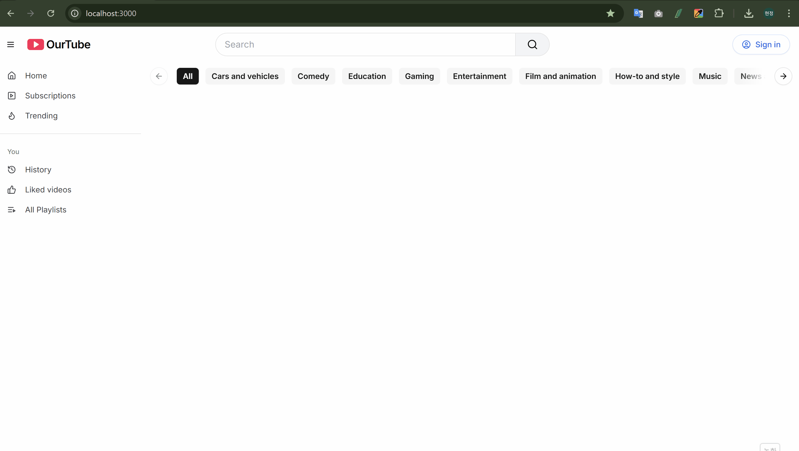
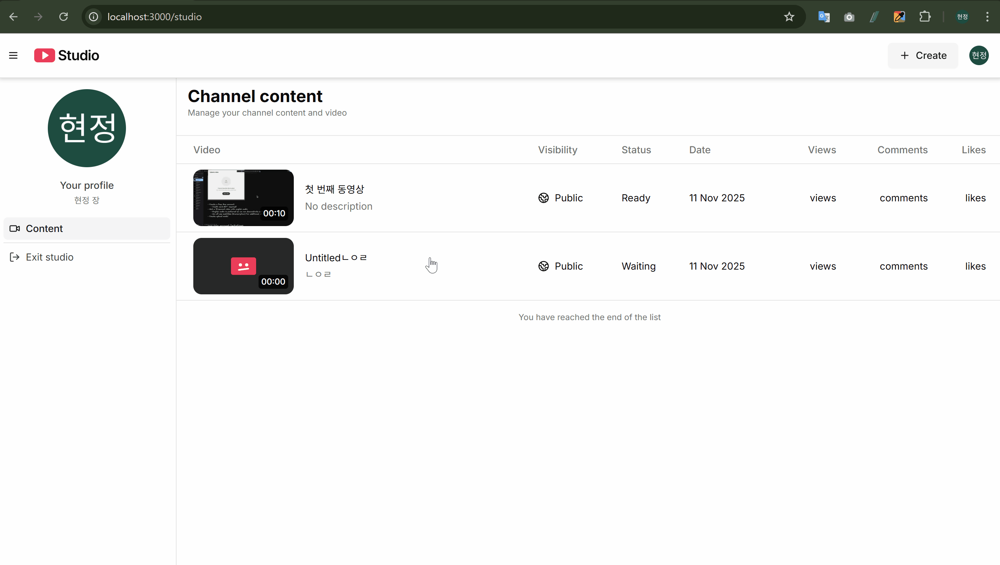
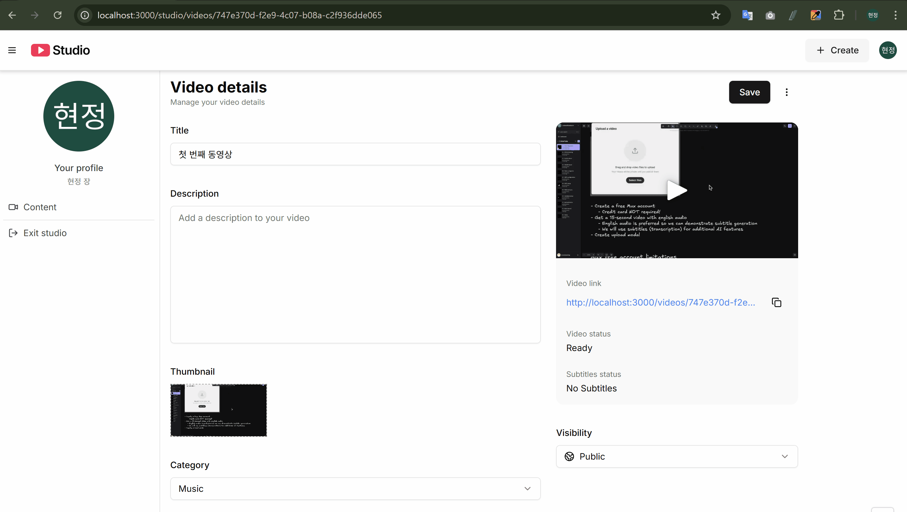
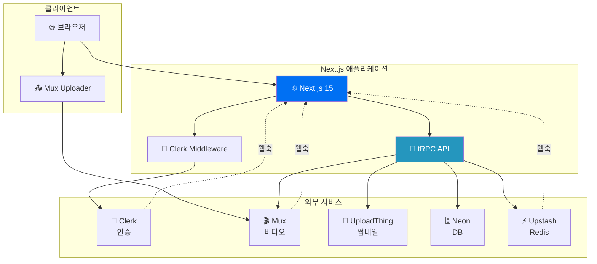
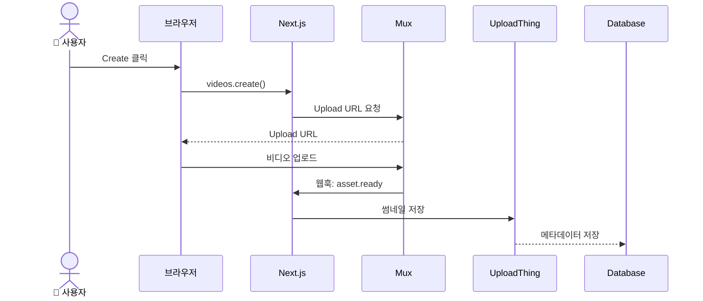

<div align="center">

# OurTube - YouTube Clone

**Next.js 기반 풀스택 비디오 스트리밍 플랫폼**

[](https://nextjs.org/)
[](https://www.typescriptlang.org/)
[](https://trpc.io/)
[](https://tailwindcss.com/)
[](LICENSE)

[데모 보기](#) · [버그 제보](https://github.com/Hyeonjeong-JANG/our-tube-next/issues) · [기능 요청](https://github.com/Hyeonjeong-JANG/our-tube-next/issues)

</div>

---

## 📖 목차

- [프로젝트 소개](#-프로젝트-소개)
- [주요 기능](#-주요-기능)
- [기술 스택](#-기술-스택)
- [빠른 시작](#-빠른-시작)
- [상세 설치 가이드](#-상세-설치-가이드)
- [프로젝트 구조](#-프로젝트-구조)
- [트러블슈팅](#-트러블슈팅)
- [라이선스](#-라이선스)
- [연락처](#-연락처)

---

## 💡 프로젝트 소개

OurTube는 YouTube를 모델로 한 풀스택 비디오 스트리밍 플랫폼입니다. **T3 Stack**(Next.js, TypeScript, tRPC)을 기반으로 하며, 현대적인 웹 기술과 최신 베스트 프랙티스를 적용하여 개발되었습니다.

### 🎥 데모

<details>
<summary>📹 비디오 업로드</summary>



</details>

<details>
<summary>🔍 비디오 탐색</summary>



</details>

<details>
<summary>🖼️ 썸네일 변경</summary>



</details>

### 왜 이 프로젝트를 만들었나요?

- 📚 **학습 목적**: T3 Stack과 풀스택 개발 실습
- 🎬 **실전 경험**: 비디오 처리, 스트리밍, 파일 업로드 등 실무 기술 습득
- 🏗️ **아키텍처 이해**: 마이크로서비스, 웹훅, 백그라운드 작업 등 실전 패턴 적용

### 특별한 점

이 프로젝트는 단순한 클론을 넘어 다음과 같은 현대적 기술을 활용합니다:

- **End-to-End Type Safety**: tRPC로 프론트엔드부터 백엔드까지 완전한 타입 안정성
- **하이브리드 미디어 아키텍처**: 비디오는 Mux에서 스트리밍, 썸네일은 UploadThing CDN에서 제공
- **웹훅 기반 비동기 처리**: 실시간 이벤트 처리 및 상태 동기화
- **AI 통합**: Upstash Workflow를 통한 자동 제목 생성

---

## ✨ 주요 기능

- 🎥 **비디오 업로드 및 스트리밍** - Mux Direct Upload를 통한 고품질 비디오 처리
- 🖼️ **자동 썸네일 생성** - 비디오 업로드 시 썸네일 및 프리뷰 GIF 자동 생성
- 🎨 **커스텀 썸네일** - 사용자가 직접 썸네일 이미지 업로드 가능
- 🤖 **AI 기반 제목 생성** - Upstash Workflow를 통한 스마트 제목 추천
- 🏷️ **카테고리 관리** - 비디오 분류 및 필터링
- 🔐 **사용자 인증** - Clerk를 통한 안전한 인증 시스템
- ⚡ **Rate Limiting** - API 요청 제한으로 서비스 보호
- 📱 **반응형 디자인** - 모든 디바이스에서 최적화된 경험

---

## 🏗️ 아키텍처

### 시스템 구조



### 비디오 업로드 플로우



> 📄 자세한 아키텍처는 [docs/architecture.md](docs/architecture.md)를 참조하세요.

---

## 🛠️ 기술 스택

### Frontend
- **Framework**: Next.js 15 (App Router)
- **Language**: TypeScript 5
- **Styling**: Tailwind CSS + Radix UI
- **State Management**: TanStack Query (React Query)
- **Form**: React Hook Form + Zod

### Backend
- **API**: tRPC 11 (End-to-End Type Safety)
- **Database**: Neon PostgreSQL + Drizzle ORM
- **Authentication**: Clerk
- **Rate Limiting**: Upstash Redis

### Media & Storage
- **Video Processing**: Mux
- **File Upload**: UploadThing
- **Background Jobs**: Upstash QStash Workflow

---

## 🚀 빠른 시작

**⏱️ 소요 시간: 약 30분~1시간** (각 서비스 계정 생성 포함)

**처음 프로젝트를 클론받았다면 이것만 따라하세요:**

```bash
# 1. 저장소 클론
git clone https://github.com/Hyeonjeong-JANG/our-tube-next.git
cd our-tube-next

# 2. 의존성 설치
npm install

# 3. 환경변수 설정
copy .env.example .env.local  # Windows
# 또는
cp .env.example .env.local    # macOS/Linux

# .env.local 파일을 열어서 각 서비스 API 키를 입력하세요
# 자세한 설정 방법은 아래 "각 서비스 설정 방법" 섹션 참고
# ⚠️ 주의: 각 서비스(Clerk, Neon, Mux 등) 계정을 직접 생성하고 API 키를 발급받아야 합니다

# 4. 데이터베이스 마이그레이션
npx drizzle-kit generate
npx drizzle-kit push

# 5. 개발 서버 실행
npm run dev              # 일반 개발 (웹훅 없이)
# 또는
npm run dev:all          # 웹훅 포함 개발 (권장)
```

브라우저에서 [http://localhost:3000](http://localhost:3000) 접속

**웹훅이 필요한가요?**
- 비디오 업로드 기능을 테스트하려면 `npm run dev:all` 사용 (웹훅 필수)
- UI만 확인하려면 `npm run dev`로 충분


---

## 📚 상세 설치 가이드

### 사전 요구사항

- Node.js 20 이상
- npm 또는 yarn
- Git
- 다음 서비스 계정:
  - [Clerk](https://clerk.com) - 인증
  - [Neon](https://neon.tech) - 데이터베이스
  - [Mux](https://mux.com) - 비디오 처리
  - [UploadThing](https://uploadthing.com) - 파일 업로드
  - [Upstash](https://upstash.com) - Redis & QStash

### 단계별 설치

#### 1. 저장소 클론

```bash
git clone https://github.com/Hyeonjeong-JANG/our-tube-next.git
cd our-tube-next
```

#### 2. 의존성 설치

```bash
npm install
```

#### 3. 환경변수 설정

`.env.example` 파일을 `.env.local`로 복사하고 실제 값으로 채워넣으세요:

```bash
# Windows
copy .env.example .env.local

# macOS/Linux
cp .env.example .env.local
```

그런 다음 `.env.local` 파일을 열어서 각 서비스에서 발급받은 실제 키로 변경하세요.

#### 4. 각 서비스 설정 방법

##### 4.1 Clerk 설정

1. [Clerk Dashboard](https://dashboard.clerk.com) 접속
2. 새 애플리케이션 생성
3. **API Keys** 탭에서 키 복사:
   - `NEXT_PUBLIC_CLERK_PUBLISHABLE_KEY`
   - `CLERK_SECRET_KEY`
4. **Webhooks** 섹션에서 새 엔드포인트 추가:
   - URL: `https://your-domain.com/api/users/webhook`
   - 이벤트 선택: `user.created`, `user.updated`, `user.deleted`
   - `CLERK_SIGNING_SECRET` 복사

##### 4.2 Neon Database 설정

1. [Neon Console](https://console.neon.tech) 접속
2. 새 프로젝트 생성
3. **Connection Details** 탭에서 **Pooled connection** 문자열 복사
4. `DATABASE_URL`에 설정

##### 4.3 Mux 설정

1. [Mux Dashboard](https://dashboard.mux.com) 접속
2. **Settings** > **Access Tokens**:
   - 새 토큰 생성 (권한: Video 읽기/쓰기)
   - `MUX_TOKEN_ID`, `MUX_TOKEN_SECRET` 복사
3. **Settings** > **Webhooks**:
   - 새 엔드포인트 추가: `https://your-domain.com/api/videos/webhook`
   - 이벤트 선택: `video.asset.*` (모든 비디오 이벤트)
   - `MUX_WEBHOOK_SECRET` 복사

##### 4.4 UploadThing 설정

1. [UploadThing Dashboard](https://uploadthing.com/dashboard) 접속
2. 새 앱 생성
3. **API Keys** 탭에서 `UPLOADTHING_TOKEN` 복사

##### 4.5 Upstash 설정

**Redis:**
1. [Upstash Console](https://console.upstash.com) 접속
2. 새 Redis 데이터베이스 생성
3. **REST API** 탭에서 URL과 토큰 복사

**QStash:**
1. Upstash Console에서 **QStash** 선택
2. **Workflow** 탭에서 토큰 및 서명 키 복사
3. `UPSTASH_WORKFLOW_URL`은 배포된 도메인 또는 ngrok URL 사용

#### 5. 데이터베이스 마이그레이션

```bash
# 마이그레이션 생성
npx drizzle-kit generate

# 데이터베이스에 스키마 적용
npx drizzle-kit push
```

**데이터베이스 확인 (선택):**
```bash
npx drizzle-kit studio
```

브라우저에서 [https://local.drizzle.studio](https://local.drizzle.studio) 접속

#### 6. 개발 서버 실행

**일반 개발 모드 (웹훅 없이):**

```bash
npm run dev
```

**웹훅 포함 개발 모드 (권장):**

```bash
npm run dev:all  # 개발 서버 + ngrok 동시 실행
```

또는 별도 터미널에서:

```bash
# 터미널 1
npm run dev

# 터미널 2
npm run dev:webhook
```

브라우저에서 [http://localhost:3000](http://localhost:3000) 접속

**중요**: 비디오 업로드를 테스트하려면 `npm run dev:all` 사용 (웹훅 필수). ngrok URL을 `.env.local`의 `UPSTASH_WORKFLOW_URL`과 Clerk/Mux 웹훅 설정에 업데이트해야 합니다.

#### 7. 프로덕션 빌드

```bash
npm run build
npm start
```

---

## 📁 프로젝트 구조

```
our-tube-next/
├── src/
│   ├── app/                    # Next.js App Router
│   │   ├── (auth)/            # 인증 페이지 (sign-in, sign-up)
│   │   ├── (home)/            # 홈 페이지
│   │   ├── (studio)/          # 스튜디오 (비디오 관리)
│   │   ├── feed/              # 비디오 시청 페이지
│   │   └── api/               # API 엔드포인트
│   │       ├── trpc/         # tRPC 핸들러
│   │       ├── uploadthing/  # 파일 업로드
│   │       ├── users/        # Clerk 웹훅
│   │       └── videos/       # Mux 웹훅 & 워크플로우
│   ├── components/            # 공통 UI 컴포넌트
│   │   └── ui/               # shadcn/ui 컴포넌트
│   ├── db/                   # Drizzle 스키마 & DB 클라이언트
│   ├── lib/                  # 외부 서비스 클라이언트
│   │   ├── mux.ts           # Mux 비디오 API
│   │   ├── redis.ts         # Upstash Redis
│   │   └── uploadthing.ts   # UploadThing CDN
│   ├── modules/              # 기능별 모듈 (server + ui)
│   │   ├── categories/      # 카테고리 관리
│   │   ├── studio/          # 비디오 스튜디오
│   │   └── videos/          # 비디오 CRUD
│   └── trpc/                 # tRPC 설정 & 라우터
├── assets/demos/              # README용 데모 GIF
├── scripts/                   # 유틸리티 스크립트
└── docs/                      # 프로젝트 문서
```

> 📄 전체 구조는 [STRUCTURE.md](STRUCTURE.md)를 참조하세요.

## 주요 워크플로우

### 비디오 업로드 흐름

1. 사용자가 "Create" 버튼 클릭
2. tRPC `videos.create` → Mux Direct Upload URL 생성
3. 클라이언트에서 MuxUploader로 비디오 업로드
4. Mux 웹훅으로 처리 상태 수신:
   - `video.asset.created`: 에셋 ID 저장
   - `video.asset.ready`: 썸네일/GIF를 UploadThing에 저장
   - `video.asset.errored`: 에러 상태 업데이트

### 썸네일 관리

1. **자동 생성**: Mux가 비디오 처리 완료 시 자동으로 썸네일 및 애니메이션 GIF 생성
2. **영구 저장**: 웹훅에서 Mux 임시 URL을 UploadThing에 업로드하여 영구 CDN URL 확보
3. **수동 업로드**: 사용자가 직접 커스텀 썸네일 업로드 가능 (기존 썸네일 자동 삭제)

### AI 제목 생성

1. 사용자가 "Generate Title" 버튼 클릭
2. Upstash Workflow로 백그라운드 작업 시작
3. AI가 비디오 메타데이터 기반 제목 생성
4. 완료 시 자동으로 DB 업데이트

---

## 🔧 트러블슈팅

### 웹훅이 작동하지 않는 경우

1. ngrok URL이 `.env.local`의 `UPSTASH_WORKFLOW_URL`과 일치하는지 확인
2. Clerk/Mux 대시보드에서 웹훅 엔드포인트 URL 확인
3. 웹훅 서명 키(`CLERK_SIGNING_SECRET`, `MUX_WEBHOOK_SECRET`)가 올바른지 확인
4. 웹훅 로그에서 에러 메시지 확인

### 데이터베이스 연결 오류

1. `DATABASE_URL`이 올바른지 확인 (특히 `sslmode=require` 포함 여부)
2. Neon 대시보드에서 데이터베이스가 활성화되어 있는지 확인
3. IP 화이트리스트 설정 확인 (Neon은 기본적으로 모든 IP 허용)

### 비디오 업로드 실패

1. Mux 토큰(`MUX_TOKEN_ID`, `MUX_TOKEN_SECRET`)이 올바른지 확인
2. Mux 웹훅이 설정되어 있는지 확인
3. UploadThing 토큰(`UPLOADTHING_TOKEN`)이 올바른지 확인
4. 브라우저 콘솔에서 CORS 에러 확인

### Rate Limit 에러

- 기본 설정: 10초당 10개 요청 제한
- 필요 시 `src/trpc/init.ts`에서 제한 완화 가능

### 마이그레이션 에러

```bash
# 기존 마이그레이션 삭제 후 재생성
rm -rf drizzle
npx drizzle-kit generate
npx drizzle-kit push
```

## 주요 API 엔드포인트

### tRPC 프로시저

- `videos.create` - Mux 업로드 URL 생성
- `videos.update` - 비디오 정보 업데이트
- `videos.remove` - 비디오 삭제
- `videos.restoreThumbnail` - Mux 썸네일 복원
- `videos.generateThumbnail` - AI 제목 생성
- `studio.getOne` - 개별 비디오 조회
- `studio.getMany` - 비디오 목록 조회 (페이지네이션)
- `categories.getAll` - 카테고리 목록

### 웹훅 엔드포인트

- `POST /api/users/webhook` - Clerk 사용자 동기화
- `POST /api/videos/webhook` - Mux 비디오 이벤트
- `POST /api/videos/workflows/title` - AI 제목 생성 워크플로우

## 환경별 설정

### 개발 환경

- ngrok을 통한 로컬 웹훅 터널링
- Drizzle Studio로 DB 실시간 확인
- Hot reload 지원

### 프로덕션 환경 (Vercel 권장)

1. Vercel에 배포
2. 환경변수 설정 (Vercel Dashboard)
3. 웹훅 URL을 Vercel 도메인으로 업데이트
4. `UPSTASH_WORKFLOW_URL`을 Vercel URL로 설정

## 성능 최적화

- 이미지 최적화: Next.js Image 컴포넌트 사용
- 비디오 스트리밍: Mux의 적응형 비트레이트 스트리밍
- CDN: UploadThing의 글로벌 CDN
- Rate Limiting: Upstash Redis 기반 요청 제한
- 캐싱: TanStack Query를 통한 클라이언트 캐싱

---

## 📄 라이선스

이 프로젝트는 **학습 목적**으로 제작되었습니다.

MIT License - 자유롭게 사용, 수정, 배포할 수 있습니다.

자세한 내용은 [LICENSE](LICENSE) 파일을 참조하세요.

---

## 👤 연락처

**Hyeonjeong JANG** - [@Hyeonjeong-JANG](https://github.com/Hyeonjeong-JANG)

프로젝트 링크: [https://github.com/Hyeonjeong-JANG/our-tube-next](https://github.com/Hyeonjeong-JANG/our-tube-next)

---

## 💬 도움말

문제가 발생하면 다음을 확인하세요:

1. ✅ 모든 환경변수가 올바르게 설정되었는지
2. ✅ 데이터베이스 마이그레이션이 완료되었는지
3. ✅ 웹훅 URL이 올바르게 설정되었는지
4. ✅ 각 서비스의 API 할당량이 충분한지

**버그를 발견하셨나요?** [이슈를 생성](https://github.com/Hyeonjeong-JANG/our-tube-next/issues)해주세요!

**기능 제안이 있으신가요?** [토론에 참여](https://github.com/Hyeonjeong-JANG/our-tube-next/discussions)해주세요!

---

<div align="center">

**⭐ 이 프로젝트가 도움이 되었다면 Star를 눌러주세요!**

Made with ❤️ by [Hyeonjeong JANG](https://github.com/Hyeonjeong-JANG)

</div>
