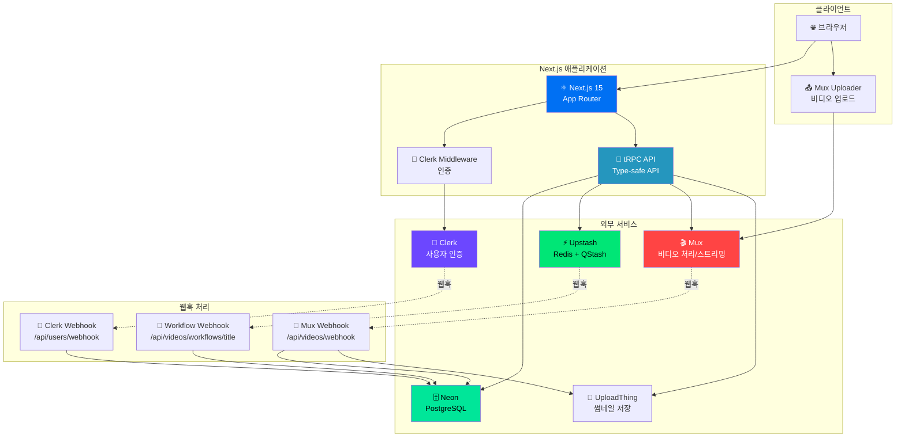
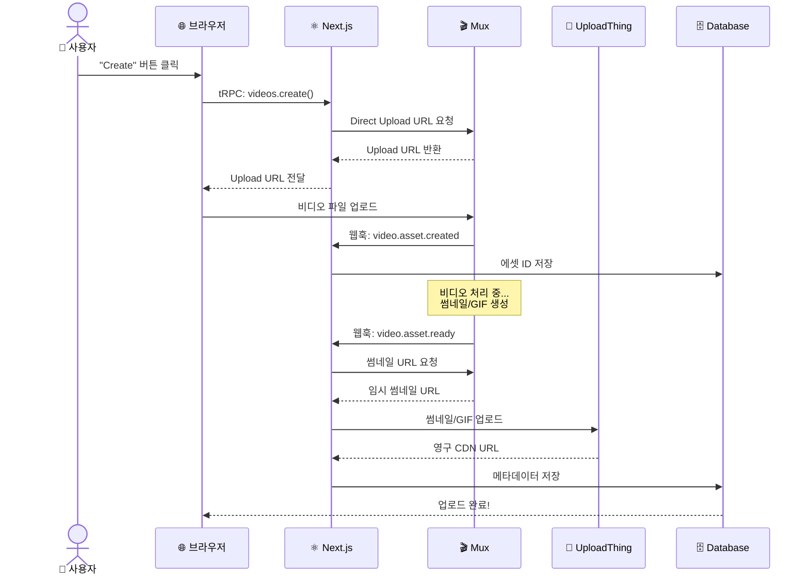
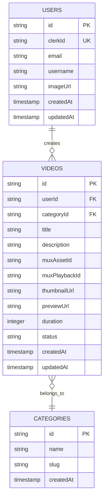
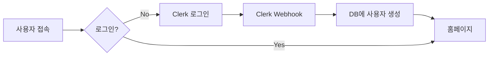
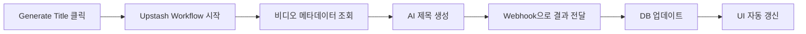

# OurTube 아키텍처

## 시스템 아키텍처

```mermaid
graph TB
    subgraph "클라이언트"
        Browser[🌐 브라우저]
        MuxUploader[📤 Mux Uploader<br/>비디오 업로드]
    end

    subgraph "Next.js 애플리케이션"
        NextApp[⚛️ Next.js 15<br/>App Router]
        tRPC[🔄 tRPC API<br/>Type-safe API]
        Middleware[🔐 Clerk Middleware<br/>인증]
    end

    subgraph "외부 서비스"
        Clerk[👤 Clerk<br/>사용자 인증]
        Mux[🎬 Mux<br/>비디오 처리/스트리밍]
        UploadThing[📁 UploadThing<br/>썸네일 저장]
        Neon[🗄️ Neon<br/>PostgreSQL]
        Upstash[⚡ Upstash<br/>Redis + QStash]
    end

    subgraph "웹훅 처리"
        ClerkWebhook[🔔 Clerk Webhook<br/>/api/users/webhook]
        MuxWebhook[🔔 Mux Webhook<br/>/api/videos/webhook]
        WorkflowWebhook[🔔 Workflow Webhook<br/>/api/videos/workflows/title]
    end

    Browser --> NextApp
    Browser --> MuxUploader
    MuxUploader --> Mux

    NextApp --> Middleware
    Middleware --> Clerk
    NextApp --> tRPC
    tRPC --> Neon
    tRPC --> Upstash
    tRPC --> Mux
    tRPC --> UploadThing

    Clerk -.웹훅.-> ClerkWebhook
    Mux -.웹훅.-> MuxWebhook
    Upstash -.웹훅.-> WorkflowWebhook

    ClerkWebhook --> Neon
    MuxWebhook --> Neon
    MuxWebhook --> UploadThing
    WorkflowWebhook --> Neon

    style NextApp fill:#0070f3,color:#fff
    style tRPC fill:#2596be,color:#fff
    style Clerk fill:#6c47ff,color:#fff
    style Mux fill:#ff4444,color:#fff
    style Neon fill:#00e699,color:#000
    style Upstash fill:#00e676,color:#000
```

## 비디오 업로드 플로우

```mermaid
sequenceDiagram
    actor User as 👤 사용자
    participant UI as 🌐 브라우저
    participant Next as ⚛️ Next.js
    participant Mux as 🎬 Mux
    participant UT as 📁 UploadThing
    participant DB as 🗄️ Database

    User->>UI: "Create" 버튼 클릭
    UI->>Next: tRPC: videos.create()
    Next->>Mux: Direct Upload URL 요청
    Mux-->>Next: Upload URL 반환
    Next-->>UI: Upload URL 전달
    UI->>Mux: 비디오 파일 업로드

    Mux->>Next: 웹훅: video.asset.created
    Next->>DB: 에셋 ID 저장

    Note over Mux: 비디오 처리 중...<br/>썸네일/GIF 생성

    Mux->>Next: 웹훅: video.asset.ready
    Next->>Mux: 썸네일 URL 요청
    Mux-->>Next: 임시 썸네일 URL
    Next->>UT: 썸네일/GIF 업로드
    UT-->>Next: 영구 CDN URL
    Next->>DB: 메타데이터 저장
    DB-->>UI: 업로드 완료!
```

## 데이터베이스 스키마

```mermaid
erDiagram
    USERS ||--o{ VIDEOS : creates
    VIDEOS }o--|| CATEGORIES : belongs_to

    USERS {
        string id PK
        string clerkId UK
        string email
        string username
        string imageUrl
        timestamp createdAt
        timestamp updatedAt
    }

    VIDEOS {
        string id PK
        string userId FK
        string categoryId FK
        string title
        string description
        string muxAssetId
        string muxPlaybackId
        string thumbnailUrl
        string previewUrl
        integer duration
        string status
        timestamp createdAt
        timestamp updatedAt
    }

    CATEGORIES {
        string id PK
        string name
        string slug
        timestamp createdAt
    }
```

## 주요 워크플로우

### 1. 사용자 인증 플로우

```mermaid
graph LR
    A[사용자 접속] --> B{로그인?}
    B -->|No| C[Clerk 로그인]
    C --> D[Clerk Webhook]
    D --> E[DB에 사용자 생성]
    E --> F[홈페이지]
    B -->|Yes| F
```

### 2. AI 제목 생성 플로우

```mermaid
graph LR
    A[Generate Title 클릭] --> B[Upstash Workflow 시작]
    B --> C[비디오 메타데이터 조회]
    C --> D[AI 제목 생성]
    D --> E[Webhook으로 결과 전달]
    E --> F[DB 업데이트]
    F --> G[UI 자동 갱신]
```
